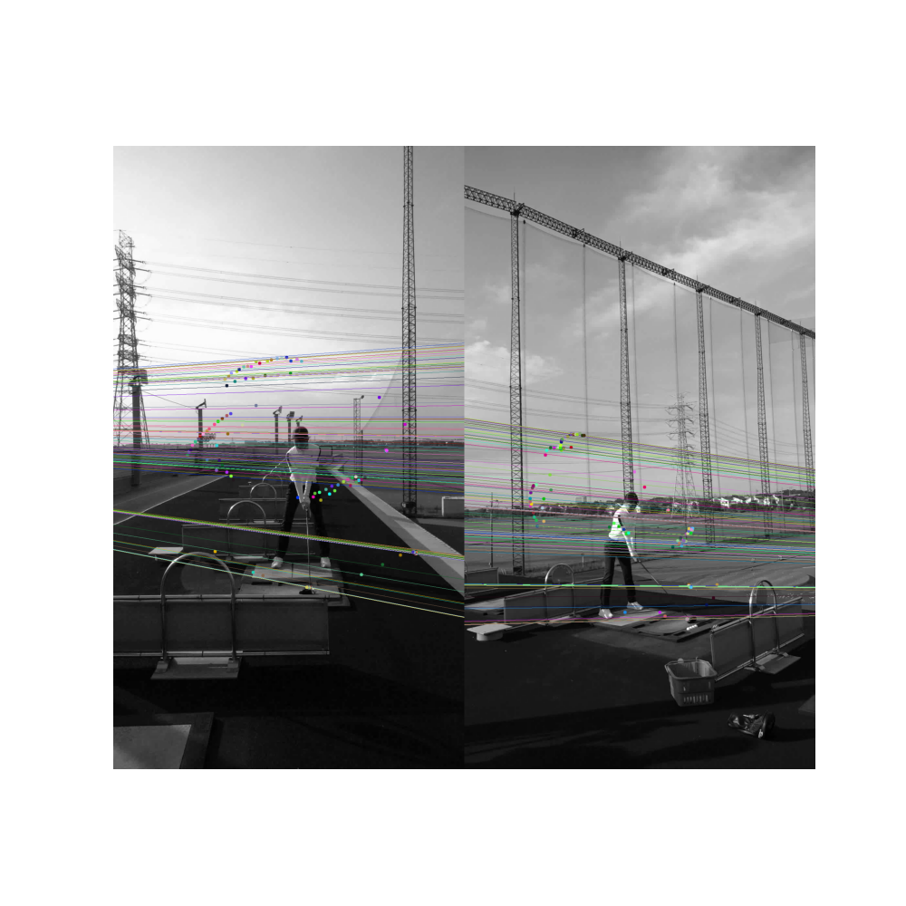

# 3D Swing Reconstruction

## 概要
このプログラムは、2つの異なるカメラアングルから撮影されたゴルフのスイングのビデオを入力として、
スイングの3D再構築を行います。ポーズ推定、クラブの位置推定、3D再構築など、一連の処理が含まれています。

## コマンドライン実行
**実行方法**
```bash
python -m [module_name] -f1 [file_path1] -f2 [file_path2] -o [output_path] -p [pose_model_path] -c [club_model_path] [-s [save_images_flag]]
```

引数:
- -f1, --file1: 最初のビデオファイルへのパス。
- -f2, --file2: 2つ目のビデオファイルへのパス。
- -o, --output: 出力ディレクトリへのパス。
- -p, --pose_model: ポーズ推定モデルへのパス。
- -c, --club_model: クラブ位置推定モデルへのパス。
- -s, --save_images: 画像を保存する場合はTrue、保存しない場合はFalse（デフォルトはFalse）。

## 処理の流れ
1. 2つのビデオからポーズ推定を行います。
2. 同様に、2つのビデオからクラブの位置推定を行います。
3. クラブのデータをもとに、カメラのパラメータを計算します。
4. 上記のデータを用いて3Dの再構築を行います。
5. 3Dデータを保存し、ビジュアライゼーションを生成します。


<p align="center">
    <br>
    fig. 1: epipolar lines
</p>